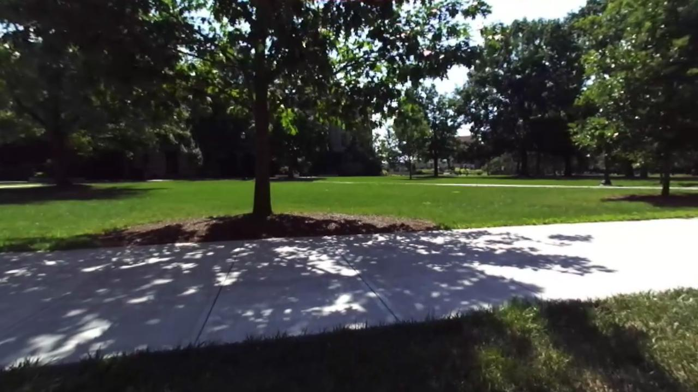
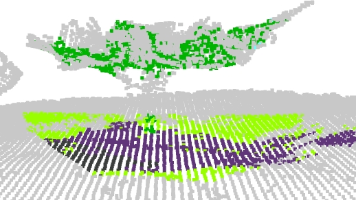
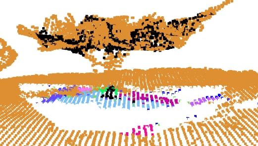
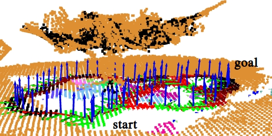
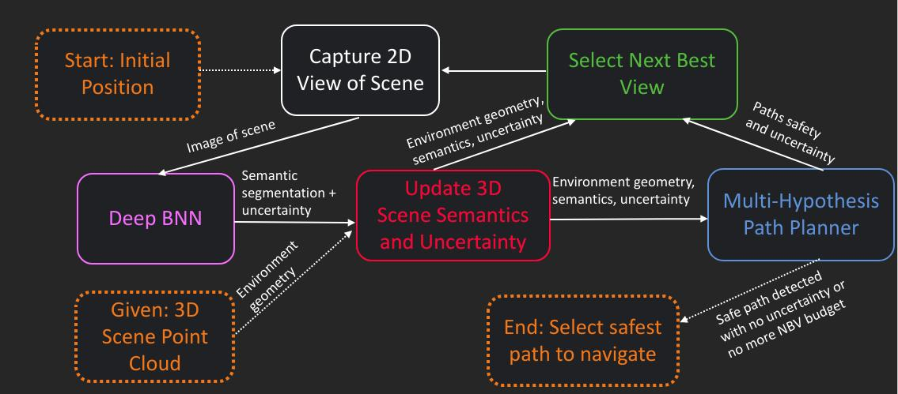

This is the project page for DeepSemanticHPPC: Hypothesis-based Planning over Uncertain Semantic Point Clouds.

{:height=100}
{:height=100}
{:height=100}
{:height=100}
 

# Links

### Paper and Slides
[Paper](https://arxiv.org/abs/2003.03464)  
[(Coming soon!) Talk Slides](./)  

### Demo and Code
[(Coming soon!) Video Demo](./)  
[(Coming soon!) Code](./)  

### Datasets
[Semantic Segmentation Dataset and Training Details](./segmentation_dataset/README.html)  
[(Coming soon!) Real-world Point Cloud Environments](./)  

# Citation

If our work is useful to you, please consider citing our paper.

<pre><code>
@article{dshppc2020,
title={DeepSemanticHPPC: Hypothesis-based Planning over Uncertain Semantic Point Clouds},
author={Han, Yutao and Lin, Hubert and Banfi, Jacopo and Campbell, Mark and Bala, Kavita},
journal={ICRA},
year={2020}
}
</code></pre>

